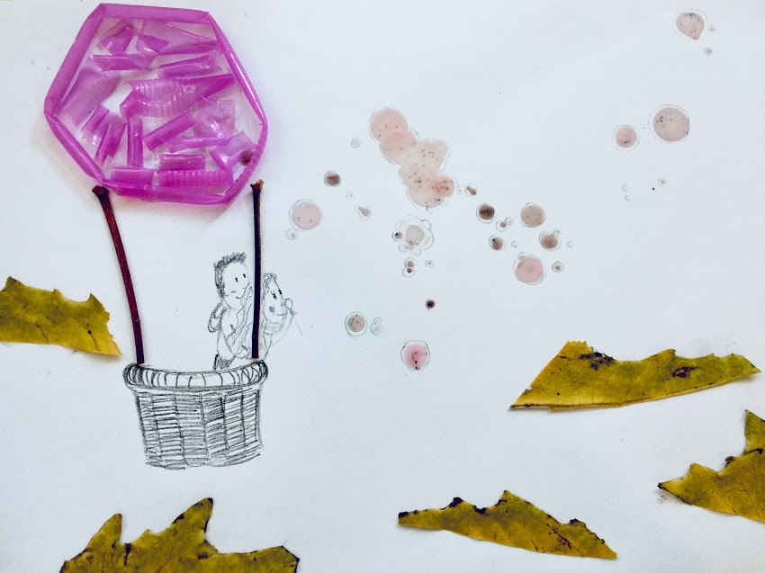

> Sokkal jobban van dolga a kettőnek, hogynem az egynek; mert azoknak jó jutalmok vala az ő munkájokból. Mert ha elesnek is, az egyik felemeli a társát. Jaj pedig az egyedülvalónak, ha elesik, és nincsen, a ki őt felemelje. Hogyha együtt feküsznek is ketten, megmelegszenek; az egyedülvaló pedig mimódon melegedhetik meg? Ha az egyiket megtámadja is valaki, ketten ellene állhatnak annak; és a hármas kötél nem hamar szakad el.

> ***Prédikátor 4, 9-12.***

---

## Rólunk

**Ha még nem lett volna alkalmad megismerni egyikünket, akkor még esküvő előtt, ha nem találkoznánk, Hello!**

*Alex* vagyok, pesti. Nagyon szeretek tanulni, ezért is lettem fizikus, mert akkor egy csomó érdekes dologgal lehet foglalkozni, rácsodálkozni a világra. Nem rég lettem kutató egy egyetemi kutatócsoportban. Mindenféle izgalmas dolgot csinálunk, orvosokkal dolgozunk, biológusoknak fejlesztünk algoritmusokat, programozó versenyeken indulunk és szuper lelkesítő az egész.

Nagyon szeretem Sárát, tudom, hogy attól, hogy a munkám fontos nekem, az elsődleges életem a hétköznap esték és a hétvégék lesznek, amikor majd együtt lehetünk, kirándulhatunk, pihenhetünk, elmehetünk a barátainkhoz. Várom már, hogy egy család legyünk. Szerintem Sára is szeret engem, mert már az első randin meg akarta fogni a kezem, de persze ezt ő mindenestül tagadja.

*Sára* vagyok, pacséri. Nyúl Zoltán és Viktória harmadik gyermeke a 7ből. Nagy kísértést érzek, hogy a családomról beszéljek, mert szeretem őket (Máté, Dóra, Dani, Samu, Kata, Johanna a tesóim, Máté felesége Timi, gyerekeik: Peti és Luca). Szeretek írni. Egy keresztény felekezetközi egyetemisták között tevékenykedő szervezetnél dolgozom, ami nagyban befolyásolta az életemet. Skill bankom: kíváncsiság, apró részletekre figyelés (életszépítés), kreativitás, vulnerability, elemző gondolkodás. 
Alexben azt szeretem (többek között, ha erről egyáltalán lehet írni), amilyen kiegyensúlyozott, erős, felelős, kitartó, megpróbált, mégis hangosan nevető, rettenthetetlen, vésszel dacoló, vajszívű Micimackó. Az sem utolsó, hogy csillagszemű juhász, nagyon okos és szociálisan érzékeny.
Hogy kissé követhető legyen a nem dióhéjnyi történet, követhetővé teszem. Természetesen a teljes történet, valahol ott kezdődik, mikor még azt mondtam, hogy „Gazdag nagynéni leszek” Alex meg gondolom nem is gondolkozott ilyesmin, de holnap majd megkérdezem. Nem minden fiú egyforma!

### Első találkozás

A természettudósok, és a gyógypedagógus felekezetközi diákcsoportosulásokban van valami nagyon hasonló. Többségében azonos neműek járnak a csoportjukba. Így történt, hogy ezen hasonlóságra építve, a vezetők úgy döntöttek, jó lenne egy közös alkalom…Egy ilyenen találkoztunk. Akkor még szinte semmi nem tűnt fel a másikból, csak annyi, hogy van.

### Első találkozás kettesben

Alex rátalált a Tejúton zokniban blogra. Annyira megtetszett neki, hogy csinált egy kamu email címet, hogy írjon egy kommentet. Majd némi bátorságot gyűjtve, kb 0 ismeret után elhívott randizni. Ez ám a bátorság!!
Egyáltalán nem értettem, hogy egy tudóssal miről lehet beszélni, de miután 5 órán át tartott az első randi, úgy találtam mégis lehet. Aztán a beszédtémák ki nem fogyása, és a jó társaság, a közös élmények egyre csak szaporodtak, míg rá nem eszméltünk, milyen otthonos is a másikkal lenni önmagunknak.

Eltartott egy darabig lezongorázni, hogy melyikünk mit akar, kinek mi a jó. Alexet próbák elé állítottam, írtunk mindenféle listákat. Melyikünk hol szeretne lenni 5/10 év múlva, milyen emberekké szeretnénk válni…
Bár nem biztos sok értelme volt ennek a résznek, mert úgyis vannak kiszámíthatatlan lépések, nem várt események, meglepetések, kudarcok. De arra jutottunk, bármifelé is tartson az életünk, azt mi együtt szeretnénk végig járni, mert nekünk jobb egymással.

### Lánykérés

Alex egyszer elmondat, mikor megint megkérdeztem, hogy miért vesz el feleségül, hogy szeretné azt a szabadságot, szeretetet, boldogságot konzerválni, amit ő ebből a kapcsolatból kap. Én pedig, az össze kalandomat, kérdésemet, örömömet, bánatomat Alex mellett szeretném megélni, mert szeret, és szeretem, és úgy szeret, hogy az nekem nagyon jó. Mikor először voltunk együtt a MÜPA-ban egy koncerten, azt éreztem, hogy nem minden új dolgot vele szeretnék átélni. Mert olyan jó vele megosztani.

Újév előtt lejött Pacsérra, hogy együtt legyünk kicsit a családdal. Én már nagyon fáradt voltam este, és hamarabb lefeküdtem, míg a többiek beszélgettek még a nappaliban. Egyszer csak Alex jön, hogy menjünk el sétálni. Ez azért is különös, mert Alex csak kerekeken szeret sétálni, és este már korom sötét volt, és aznap esett is eső. Szóval nem egy sétaideális helyzet volt. De Alex hajtatatlansága ellen esélyem sem volt, meg talán sejtettem is, hogy valami vár.

Egy random utca, random lámpája alá vezetett Alex mikor már hazafelé vettük az irányt. Ekkor Alex valamit babrált a táskájában, és adott egy lapot, hogy fogjam már meg…Ez egy képeslap volt, amire rajzolt egy gyűrűt, a Prédikátorból idézett résszel: „Jobban boldogul kettő, mint egy: fáradozásuknak szép eredménye van.”

Majd megkérdezte, lennék-e a felesége. Olyan biztos volt a kérdése. S én boldogan válaszoltam, hogy leszek. Előtte azért megkérdeztem, hogy ezt most igazából kérdezi-e. De a zsebből kihúzott gyűrű minden kétséget eloszlatott. Igen. Ez igazi.

***Október 5***-ét pedig már nagyon várjuk! Meg téged is ♥
Ha van kérdésed rólunk, kérdezz! Legyél kíváncsi, mi pedig válaszolunk!

 Sára és Alex 
